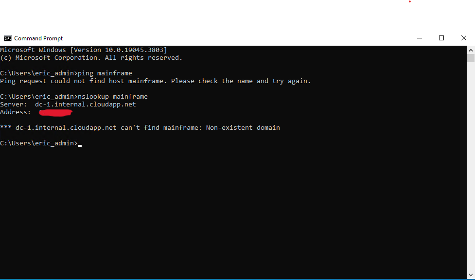
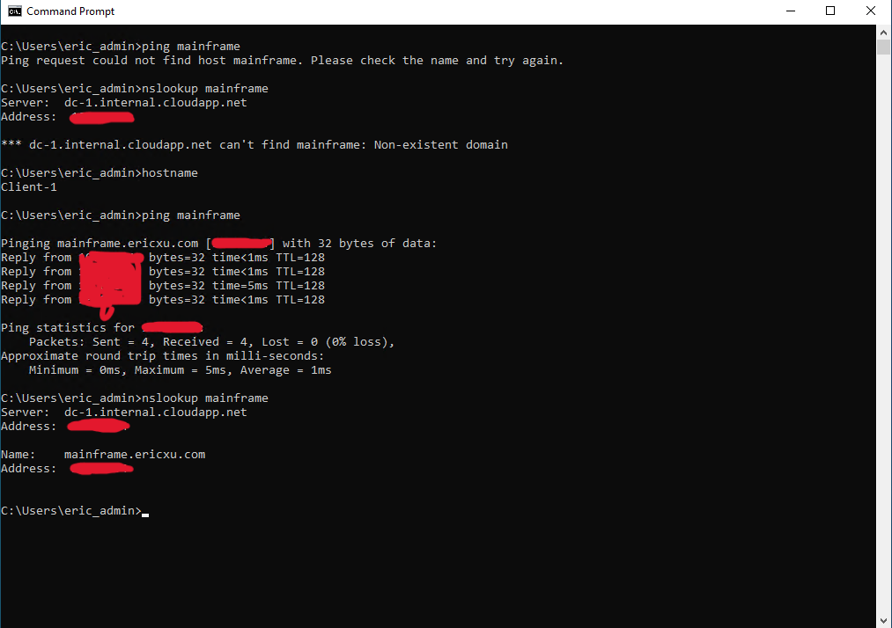
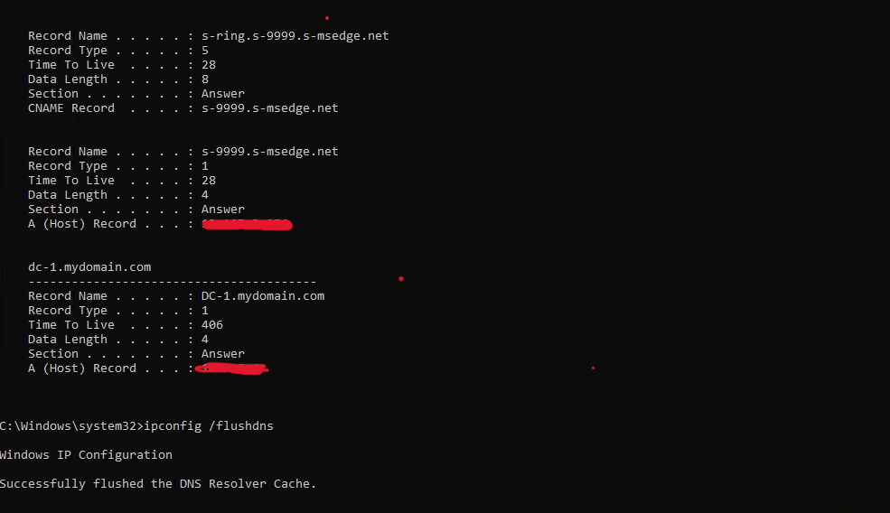

<h1>DNS - Building Intuition</h1>

 ### [YouTube Demonstration](https://youtu.be/7eJexJVCqJo)

<h2>Description</h2>
Using the Active Directory we created in the previous lab, we connect/log into DC-1 and Client-1 with our domain admin and admin accounts. We then perform a local DNS cache exercise by pinging DC-1's mainframe, observe local DNS cache, & then flush the cache. Finally for our CNAME Record Exercise, we create a CNAME record that points to the host "search" to a familiar website, try to ping "search" from Client-1, and then nslookup "search and observe the results of the CNAME record. 
<br />


<h2>Languages and Utilities Used</h2>

- <b>PowerShell</b> 
- <b>DNS</b>
- <b>IP Addressing</b> 

<h2>Environments Used </h2>

- <b>Microsoft Azure</b>
- <b>Windows Server</b> (2022)
- <b>Windows 10</b> (21H2)

<h2>Program walk-through:</h2>

<p align="center">
Create DNS A-Record on DC-1 for "mainframe" <br/>

<br />
<br />
Ping "mainframe" Client-1  <br/>

<br />
<br />
Ping "mainframe" again <br/>

<br />
<br />
Observe local DNS cache and flush DNS cache <br/>

<br />
<br />
ping "search" and nslookup  <br/>

<br />
</p>

<!--
 ```diff
- text in red
+ text in green
! text in orange
# text in gray
@@ text in purple (and bold)@@
```
--!>
